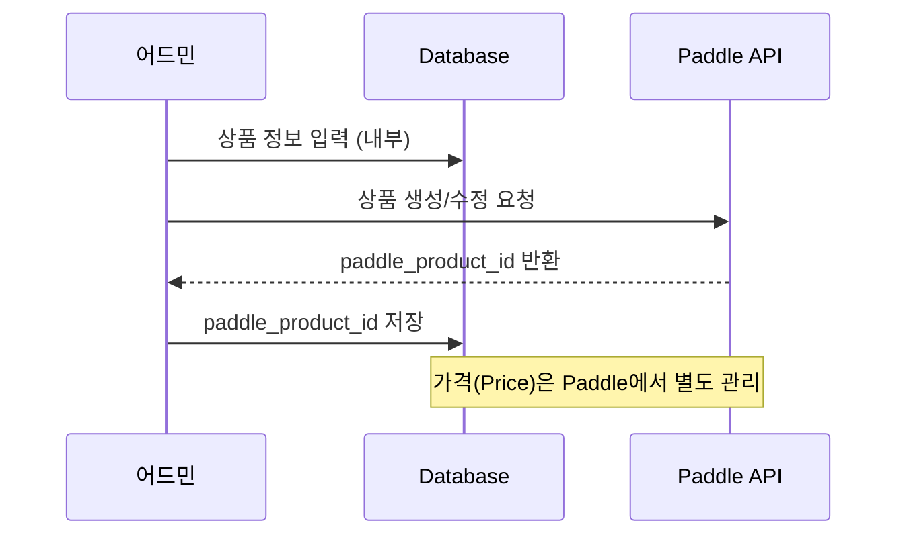

# 상품 관리 기능 명세서 (Admin Product Management Specification)

## 1. 개요
서비스에서 판매하는 구독 상품 및 개별 상품을 관리하고, **Paddle** 결제 시스템과 연동하며, 다국어/다통화 정보 및 도구 번들링 설정을 수행하는 기능을 제공합니다.

## 2. 데이터베이스 스키마 설계
기존 스키마(`src/lib/db/schema.ts`)를 활용합니다.

### 2.1 `products` 테이블
상품의 핵심 속성을 저장합니다.
- `id`: UUID (Primary Key)
- `paddle_product_id`: Paddle 시스템의 상품 ID (외부 연동용, Text)
- `paddle_price_id`: Paddle 시스템의 가격 ID (Product와 1:1 관계, Text)
- `type`: `product_type_enum` (SUBSCRIPTION, PURCHASE) - 구독형/1회성 구분
- `category`: 상품 카테고리 (Text, 예: GENERAL)
- `billing_cycle`: 결제 주기 (Text, 예: MONTHLY, YEARLY, ONCE)
- `product_code`: 시스템 내부 고유 코드 (Text)
- `icon_image_url`: 상품 아이콘 경로 (Text)
- `is_active`: 활성화 상태 (Boolean, Default: true)
- `sort_order`: 정렬 순서 (Integer)
- `created_at`, `updated_at`, `deleted_at`: 타임스탬프

> [!NOTE]
> 현재 `products` 테이블에는 `type`, `category`, `billing_cycle`, `product_code`, `updated_at`, `deleted_at` 컬럼이 없으므로 마이그레이션 필요

### 2.2 `products_i18n` 테이블
상품의 다국어 및 다통화 정보를 저장합니다.
- `id`: UUID (Primary Key)
- `product_id`: `products.id` (Foreign Key)
- `language_code`: `language_code_enum` (KR, EN, JP)
- `currency_code`: `currency_code_enum` (KRW, USD, JPY)
- `name`: 상품명
- `description`: 상품 설명
- `price`: 정가 (Numeric)
- `current_price`: 현재 판매가 (Numeric, 할인 적용 시 사용)

### 2.3 `product_tools` 테이블 (도구 번들링)
상품과 도구 간의 연결 및 제공량을 관리합니다.
- `id`: UUID (Primary Key)
- `product_id`: `products.id` (Foreign Key)
- `tool_id`: `tools.id` (Foreign Key)
- `quota_allocation`: 월간 제공량 (Integer)
- `sort_order`: 도구 표시 순서 (Integer) - 추가 필요

### 2.4 Paddle 연동 관련 테이블 (참조)
- `user_payment_infos`: 사용자별 Paddle Customer ID 저장
- `payment_transactions`: 결제 내역 기록
- `user_purchases`: 사용자 구매/구독 정보

## 3. Paddle 연동 상세

### 3.1 상품 연동 흐름


### 3.2 Product-Price 관계 및 연동 전략

> [!IMPORTANT]
> Paddle에서 Product와 Price는 별도 엔티티이지만, 본 시스템에서는 **1:1 관계**로 관리합니다.

- **Product 1:1 Price**: 하나의 상품에 하나의 Paddle Price만 연결 (기본 통화: USD)
- **다통화 가격 관리**: `products_i18n` 테이블을 통해 국가/통화별 가격 정보 간 저장 (어드민 UI에서 직접 입력)
- **Paddle Price 동기화**: 상품 생성/수정 시 Paddle API를 통해 Price 생성 및 `paddle_price_id` 저장

### 3.3 Paddle 연동 기능
- **상품 생성**: Paddle API를 통해 Product 생성 후 `paddle_product_id` 저장
- **가격 생성**: Paddle API를 통해 Price 생성 후 `paddle_price_id` 저장 (어드민 UI에서 관리)
- **Webhook 수신**: `product.created`, `product.updated`, `price.created`, `price.updated` 이벤트 처리
- **체크아웃 연동**: Paddle Checkout Overlay를 통한 결제 흐름

### 3.4 Paddle SDK 사용
```typescript
// @paddle/paddle-node-sdk 활용
import { Paddle } from '@paddle/paddle-node-sdk';

const paddle = new Paddle(process.env.PADDLE_API_KEY!);

// 상품 생성 예시
const product = await paddle.products.create({
  name: '상품명',
  taxCategory: 'standard',
  description: '상품 설명',
});

// 가격 생성 예시 (Product와 1:1)
const price = await paddle.prices.create({
  productId: product.id,
  unitPrice: { amount: '1000', currencyCode: 'USD' },
  billingCycle: { interval: 'month', frequency: 1 },
});
```

## 4. 기능 상세

### 4.1 상품 목록 조회 (List View)
- **경로**: `/products/list`
- **주요 기능**:
    - 테이블 형태의 목록 표시 (MUI DataGrid 권장)
    - **검색**: 상품명(다국어 포함) 키워드 검색
    - **필터**: 상태(전체, 활성, 비활성), 주기(월간, 연간, 1회성) 필터링
    - **컬럼**: 상품명, 가격(USD), 주기, 상태, 작성일, 수정일, 작업(수정/삭제)

### 4.2 상품 등록 및 수정 (Multi-Step Form)
2개의 탭(Step)으로 구성된 등록/수정 폼입니다.

#### Step 1: 기본 정보 탭
- **경로**: `/products/list/new` 또는 `/products/list/[id]`
- **주요 기능**:
    - **상품 속성**: 구분, 주기(월간/연간/1회성), 카테고리 선택
    - **1회성 여부**: 토글로 설정 (product_type_enum 연동)
    - **상품 코드**: 자동 생성 및 복사 기능
    - **Paddle 연동**: 버튼 클릭 시 Paddle 상품 생성/연결
    - **다국어 가격 입력**: 한국어/영어/일본어 탭별 상품명, 가격 입력
    - **도구 번들링**:
        - 도구 검색 및 선택 (Autocomplete)
        - 선택된 도구 리스트: 순서 변경(DnD), 월 제공량 입력, 삭제
    - **임시 저장**: 다음 버튼 클릭 시 자동 저장

#### Step 2: 상세 정보 탭
- **주요 기능**:
    - **다국어 설명**: 한국어/영어/일본어 상품 상세 설명 (Textarea)
    - **아이콘 이미지**: 업로드 (권장 512x512px) 및 URL 확인
    - **활성화 토글**: 사용자 노출 여부
    - **저장**: 최종 저장 버튼

### 4.3 상품 삭제
- 목록에서 삭제 버튼 클릭 시 확인 다이얼로그 노출
- Soft Delete 수행 (`deleted_at` 타임스탬프 설정)

> [!WARNING]
> Paddle에 이미 연동된 상품은 Paddle 측에서도 비활성화 처리가 필요할 수 있음

## 5. 데이터 처리 설계 (Server Actions & Server Components)

Next.js App Router의 기능을 활용하며, Paddle API 연동 시 Server Actions 사용.

### 5.1 데이터 조회 (Data Fetching)
- **Server Components**에서 Drizzle ORM을 사용하여 직접 DB 접근
- 검색/필터링: URL Query Parameter(`searchParams`) 기반 서버 쿼리
- 다국어 정보: `products_i18n` 조인 또는 관계 쿼리

### 5.2 데이터 변경 (Mutations)
- **위치**: `src/features/admin/products/actions.ts`
- **주요 Actions**:
  - `createProductAction(data: ProductSchema)`: 상품 및 다국어/도구 정보 생성 (트랜잭션)
  - `updateProductAction(id: string, data: Partial<ProductSchema>)`: 상품 정보 수정
  - `deleteProductAction(id: string)`: 상품 삭제 (Soft Delete)
  - `toggleProductStatusAction(id: string, isActive: boolean)`: 활성화 상태 토글
  - `linkPaddleProductAction(id: string)`: Paddle 상품 생성 및 연결
  - `syncPaddleProductAction(id: string)`: Paddle 상품 정보 동기화
- **유효성 검사**: `zod`를 사용하여 서버 사이드 입력값 검증
- **피드백**: `useActionState` 또는 `toast`를 통해 성공/실패 메시지 표시

### 5.3 Paddle SDK 서비스
- **위치**: `src/lib/paddle.ts` 또는 `src/features/billing/paddle-service.ts`
- **기능**:
  - Paddle SDK 인스턴스 생성 및 관리
  - 상품 생성/조회/수정 API 래퍼
  - 가격 생성/조회 API 래퍼

## 6. UI/UX 디자인 가이드

### 6.1 컴포넌트 구성
- **목록**: MUI DataGrid (기존 도구 관리와 통일)
- **폼**: React Hook Form + Zod
- **탭**: Stepper 또는 Tabs 컴포넌트 (Step 1/2)
- **다국어 입력**: 언어별 Tabs 그룹
- **도구 선택**: Autocomplete + Chip List
- **드래그앤드롭**: `@dnd-kit/core` 활용

### 6.2 레이아웃
- 데스크탑 최우선, 관리자 페이지용 레이아웃 준수
- 좌측 사이드바에서 "상품 관리 > 상품 목록" 진입

## 7. API 엔드포인트 (참조)

Paddle Webhook 수신용 API Route는 기존 구현을 활용:
- `POST /api/webhooks/paddle`: Paddle 이벤트 수신 및 처리

## 8. 스키마 마이그레이션 요약

```sql
-- products 테이블 확장
ALTER TABLE products 
  ADD COLUMN type product_type_enum DEFAULT 'SUBSCRIPTION',
  ADD COLUMN category TEXT,
  ADD COLUMN billing_cycle TEXT DEFAULT 'MONTHLY',
  ADD COLUMN product_code TEXT,
  ADD COLUMN paddle_price_id TEXT,
  ADD COLUMN icon_image_url TEXT,
  ADD COLUMN updated_at TIMESTAMP WITH TIME ZONE DEFAULT CURRENT_TIMESTAMP,
  ADD COLUMN deleted_at TIMESTAMP WITH TIME ZONE;

-- product_tools 테이블 확장
ALTER TABLE product_tools
  ADD COLUMN sort_order INTEGER DEFAULT 0;
```
